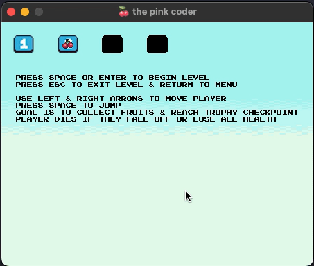
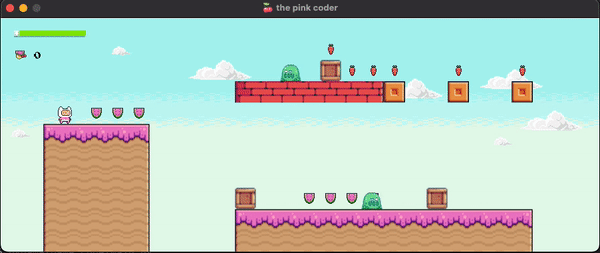
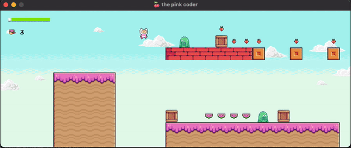
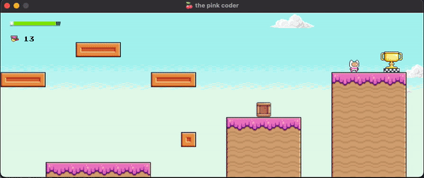
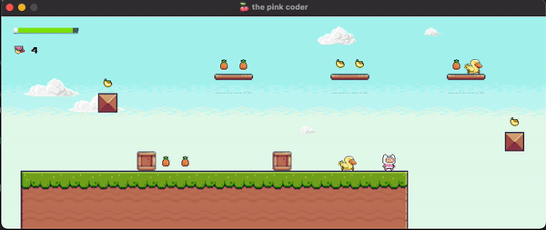
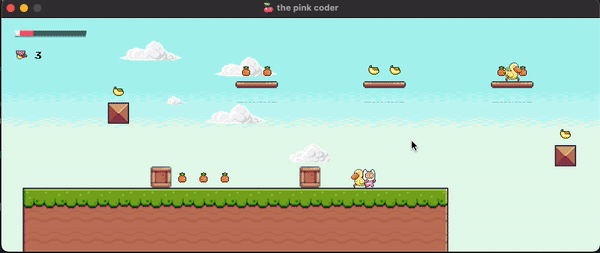

# christinaa the pink coder game
There are currently 4 levels available for play. Only level 1 is initially unlocked, but each level you beat unlocks the next level.

## set up directions
1. Download the zip file by going to **Code** in the top right corner, and click **Download ZIP**
2. Unzip the file
3. Open the ENTIRE python project in your IDE
4. Run the **main.py** file in the **game_code** module to play the game!

## how to play the game
Once you've started the game the game menu will pop up!

- use the left and right arrows to move between the unlocked levels, and press SPACE to begin playing.  

- use left and right arrows to move player
- collect as many fruits as you can (fruit count will be in the top left)

- press SPACE to jump
- jump ON TOP of the enemies to kill them

- you unlock the next level once you reach the trophy

- you die if you fall off OR run out of health (health bar will be in top left)
### FALL DEMO

### HEALTH DEMO

- in the game over page, press **Y** if you want to play that level again, or **N** to return to the menu
- exit the **levels** at anytime by pressing **ESC**
- exit the **game** by pressing **ESC** in the menu
